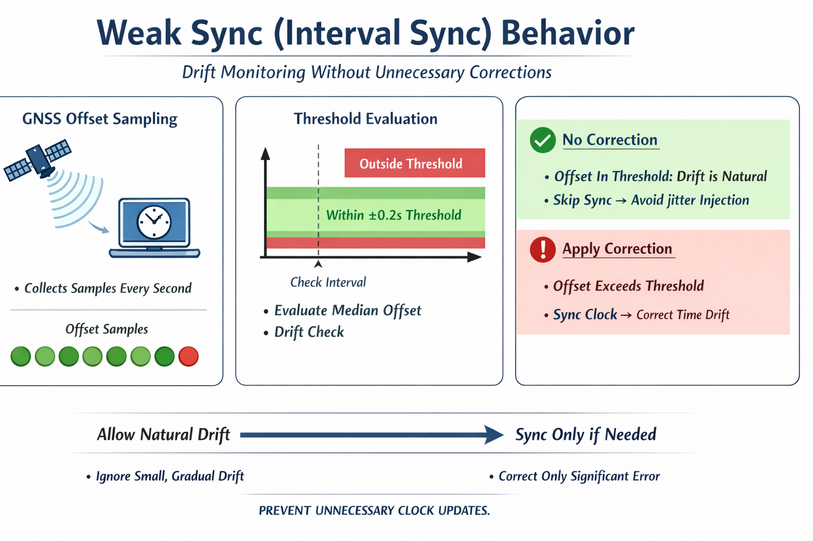

> [!NOTE]
> This project was formerly known as `gps-time-sync`.

# ChronoGPS

**GPS / NTP Time Synchronization Tool for Windows**

A tool to accurately synchronize your Windows PC clock using a GPS receiver or NTP server.  
Designed for high-precision time alignment required for FT8 and other digital amateur radio modes.  
Runs safely in **Monitor-Only** mode even without administrator privileges.

🌐 [日本語 README](README.md)


---

## Design Philosophy

ChronoGPS is designed with one simple goal:  
**to provide accurate time with minimal user intervention.**

- Use GPS or NTP depending on availability and environment
- Perform synchronization safely in the background while keeping the UI stable
- Provide a reliable time reference for FT8 and measurement use cases

Rather than visual effects, the focus is on **accuracy, stability, and long-term operation**.

For detailed explanations of ChronoGPS design decisions and synchronization behavior,
please refer to the FAQ:
👉 [FAQ (English)](docs/FAQ.en.md)

---

## Why ChronoGPS?

If you are interested in the design philosophy behind ChronoGPS —  
including transparency, how administrator privileges are handled, and the idea of a *monitor-only mode* —  
please see the detailed discussion below:

- 🔗 **Why ChronoGPS (Discussion)**: https://github.com/jp1lrt/ChronoGPS/discussions/3

---

## Features

- 🌐 **NTP Sync (RFC 5905)** — 64-bit timestamps, offset/delay calculation via t1/t2/t3/t4, millisecond-level precision
- 🛰️ **GPS Sync** — Off / Instant / Scheduled modes, RMC-based UTC acquisition, duplicate sync prevention  
  Scheduled mode uses a GPS-reception-triggered approach with median jitter filtering.  
  This reduces jitter injection while allowing long-term drift monitoring.
- ⏱️ **FT8 Time Offset** — Fine-tune clock in ±0.1s steps, designed for digital mode operation
- 📡 **Satellite View** — Real-time display of GPS / GLONASS / BeiDou / Galileo / SBAS / QZSS
- 🔒 **Non-Admin Support (v2.5 enhanced)** — Starts in Monitor-Only mode by default. Elevate only when sync is needed via the on-screen banner
- 🧵 **Thread-Safe GUI** — Worker thread + Queue + main thread updates prevent Tkinter freezes
- 🌍 **16 Languages** — Japanese, English, French, Spanish, German, Chinese (Simplified/Traditional), Korean, Portuguese, Italian, Dutch, Russian, Polish, Turkish, Swedish, Indonesian
- 🖥️ **Windows-Native UX** — System tray support, the close (X) button minimizes to the system tray, taskbar icon

---

## Operation Modes (v2.5+)

Starting with v2.5, the UAC dialog at launch has been removed.  
ChronoGPS **always starts in Monitor-Only mode** by default.  
Elevation is only requested when the user explicitly wants sync.

### At Launch (Default: Monitor-Only)
- No UAC dialog is shown
- GPS reception, satellite view, and NTP display are available immediately
- A banner at the top of the window shows: **"Unlock Sync Features (Restart as Administrator)"**

### When You Need Time Sync
- Click the banner button → UAC dialog appears → Restart as administrator
- If you cancel the UAC dialog, Monitor-Only mode continues — **the process is not terminated**
- After elevation, the banner disappears and GPS/NTP sync becomes available

### Command-Line Launch
```powershell
# Monitor-Only mode (default)
.\ChronoGPS.exe

# Sync mode (banner still appears if not admin)
.\ChronoGPS.exe --mode=sync
```

---

## Requirements

- Windows 10 / 11
- Python 3.11+ (for script execution)
- GPS receiver (for GPS sync)
- Administrator privileges (for time synchronization)

---

## Installation & Launch

### Using the exe (Recommended)

1. Place `ChronoGPS.exe` and `icon.ico` in the same folder
2. Double-click `ChronoGPS.exe` to launch (starts in Monitor-Only mode)
3. If time sync is needed, click the banner at the top to elevate

### Running from source

```powershell
python -m venv .venv
.\.venv\Scripts\Activate.ps1
pip install -r requirements.txt
python main.py
```

---

## How to Build the exe (for developers)

ChronoGPS is designed to be built inside a venv (virtual environment).  
Running PyInstaller in a global Python environment is not recommended,  
as it may cause dependency contamination and reduce build reproducibility.

### 1. Create and activate a virtual environment (Windows / PowerShell)
```powershell
python -m venv .venv
.\.venv\Scripts\Activate.ps1
```

### 2. Install dependencies
```powershell
pip install -r requirements.txt
pip install -r requirements-dev.txt
pip install -U pyinstaller
```

### 3. Run tests (required)
```powershell
python -m pytest -q
```

Make sure all tests pass before building the executable.

### 4. Build the exe (clean build)

```powershell
pyinstaller --noconfirm --clean --onefile --windowed `
  --name "ChronoGPS" `
  --icon ".\icon.ico" `
  --add-data ".\icon.ico;." `
  --add-data ".\icon.png;." `
  --add-data ".\donate_qr.png;." `
  --add-data ".\locales.py;." `
  --add-data ".\locales_override.py;." `
  --add-data ".\gps_time_sync_config.json;." `
  --hidden-import "tkinter" `
  --hidden-import "tkinter.ttk" `
  --hidden-import "tkinter.messagebox" `
  --hidden-import "tkinter.filedialog" `
  --hidden-import "tkinter.scrolledtext" `
  --hidden-import "admin" `
  --hidden-import "startup" `
  --hidden-import "shutdown_manager" `
  --collect-submodules "tkinter" `
  .\main.py
```

**Build policy**
- Always use `--clean` to prevent contamination from previous build/dist artifacts
- Since v2.5, `admin` / `startup` / `shutdown_manager` are explicitly listed under `--hidden-import`
- Only explicitly include required files — never bundle the entire project directory

After the build completes, `ChronoGPS.exe` will be created in the `dist` directory.

### 5. About icons
- The exe file uses the ChronoGPS application icon
- The tray icon intentionally uses a clock icon for better visibility  
  (to avoid loss of contrast at small tray icon sizes)

---

## Usage

### GPS Sync

1. Connect your GPS receiver to the PC
2. Select the COM port and baud rate (usually 9600)
3. Click **Start** to begin receiving
4. Set GPS sync mode to **Instant** or **Scheduled**

### GNSS Sync Recommendation

ChronoGPS uses GNSS (GPS, QZSS, etc.) as an absolute UTC time source.

For everyday FT8 / FT4 operation, **Instant Sync** is recommended.

Instant Sync is designed to:

- Calibrate the Windows system clock using GNSS
- Then **monitor the offset while respecting the OS time model**
- Apply **only minimal, necessary, and explainable corrections** when needed

The key point is that Instant Sync **does not** mean
"rewrite the system time every second."

> [!NOTE]
> **What "Instant Sync is usually sufficient" means**
>
> It means **you do not need to repeatedly force clock rewrites** once the system clock has been properly calibrated.
>
> It does **not** mean you should turn synchronization off afterward.
> Keeping **Instant Sync enabled during operation is perfectly fine.**
>
> Instant Sync continuously references GNSS, but corrections are applied **only when necessary**.
>
> It also does **not** mean GPS reception should be stopped.
> GPS reception may continue for monitoring, visualization, and verification purposes without any issue.

**Interval Sync (Weak Sync)** is intended for:

- Monitoring clock drift during long sessions
- Verifying GNSS reception stability
- Diagnostics and verification

For a deeper explanation of the design philosophy — including why Instant Sync works well for FT8/FT4,
how Weak Sync behaves, and how ChronoGPS avoids injecting GNSS jitter into the OS clock — please see the FAQ:

👉 [FAQ (English)](docs/FAQ.en.md)

---

### Weak Sync (Interval) Behavior



*Weak Sync (Interval) is primarily intended for monitoring.  
When the offset remains within the threshold, no correction is applied by design.*

> Interval (Weak Sync) follows the model:  
> "collect samples every second → evaluate only when the interval is reached."  
> If the offset is within the threshold, the system clock is intentionally not adjusted,  
> preventing GNSS reception jitter from being injected while still monitoring drift.

**Interval Sync is not designed for continuous clock correction.**  
For real-world FT8 / FT4 operation, **Instant Sync is strongly recommended**.

#### How it works
- ChronoGPS continuously **collects GNSS time offset samples every second** (without modifying the OS clock)
- When the configured interval is reached, the accumulated samples are evaluated to decide whether a correction is necessary
- If the median offset is within the threshold, ChronoGPS **intentionally skips applying `SetSystemTime`** to avoid injecting GNSS reception jitter into Windows

#### Gradual one-direction drift (this is normal)
You may observe a gradual one-direction drift in the log, such as `-0.03s → -0.05s`.

In most cases, this represents the **natural drift of the PC's system clock**, not a synchronization error.  
As long as the offset remains within the threshold, ChronoGPS will deliberately **not** correct it.

#### Default weak-sync parameters
- Threshold: **±0.2 seconds**
- Sample window: **median of the last 30 seconds**

---

### NTP Sync

1. Enter an NTP server (default: `pool.ntp.org`)
   - Recommended for Japan: `ntp.nict.jp`
2. Click **NTP Sync** for immediate sync, or enable auto-sync

### FT8 Offset

If your FT8 timing is slightly off, enter an offset value (seconds) and click **Apply**.  
Quick ±0.1s adjustment buttons are also available.

---

## About Displayed Time Differences

You may occasionally see small differences between the displayed  
System Time, GPS Time, and NTP Time.

These differences are caused by update timing and display refresh intervals.  
They do **not** indicate an error in actual time synchronization.

The internal synchronization logic maintains millisecond-level accuracy.

---

## About Satellite Information

| Display | Meaning |
|---|---|
| In Use (GNSS) | GPS / GLONASS / BeiDou / Galileo primary satellites — used directly for time and position |
| In Use (SBAS) | WAAS / MSAS / EGNOS augmentation satellites — used for correction, not as a time source |
| Tracked | Received but not used in the time/position solution |

SBAS satellites (MSAS in Japan) may be tracked but not appear as *In Use* — this is normal behavior.  
SBAS provides augmentation corrections, not a primary clock signal.

ChronoGPS uses GNSS primary satellites and NTP for time synchronization,  
a design comparable to professional GNSS timing receivers.

QZSS (Quasi-Zenith Satellite System / Michibiki) will appear in the satellite view tab if supported by the receiver.  
Some receivers disable QZSS NMEA output by default — an empty QZSS panel is normal behavior.

---

## Notes

- Starting with v2.5, the UAC dialog at launch has been removed. ChronoGPS starts in Monitor-Only mode by default
- To enable time sync, click the banner at the top of the window to elevate
- **The × button minimizes to the system tray.** To fully exit, right-click the tray icon → *Quit*
- Default NTP server is `pool.ntp.org` (can be changed to any preferred server)

---

## File Structure

```
ChronoGPS/
├── README.md
├── README.en.md
├── docs/
│   ├── FAQ.md
│   ├── FAQ.en.md
│   ├── weak-sync-diagram.en.png
│   └── weak-sync-diagram.ja2.png
├── main.py               # Entry point
├── gui.py                # Main GUI
├── startup.py            # Argument parsing, mode selection, Mutex management (v2.5)
├── admin.py              # Admin check, UAC elevation (v2.5)
├── shutdown_manager.py   # Shutdown sequence management (v2.5)
├── config.py             # Settings (JSON)
├── locales.py            # Localization
├── locales_override.py   # Localization overrides
├── nmea_parser.py        # NMEA parser
├── ntp_client.py         # NTP client
├── time_sync.py          # Time synchronization
├── autostart.py          # Auto-start management
├── tray_icon.py          # System tray
├── requirements.txt      # Dependencies
├── icon.png              # App icon (PNG)
├── icon.ico              # App icon (ICO)
└── gps_time_sync_config.json  # Config file (auto-generated)
```

---

## Download

Official binaries are distributed via GitHub Releases. Always check the "Latest" release.

- Latest release: https://github.com/jp1lrt/ChronoGPS/releases/latest
- [ChronoGPS.exe](https://github.com/jp1lrt/ChronoGPS/releases/latest/download/ChronoGPS.exe) — Windows executable
- [icon.ico](https://github.com/jp1lrt/ChronoGPS/releases/latest/download/icon.ico) — Application icon

Included files:
- ChronoGPS.exe — Windows executable (PyInstaller build)
- icon.ico — Application icon
- checksums.txt — SHA256 checksums for release files

Verify downloaded binary (PowerShell):
```powershell
Get-FileHash .\ChronoGPS.exe -Algorithm SHA256
```
Compare the printed hash with the corresponding line in `checksums.txt` attached to the release.

### Security Notes
- Always download from the official GitHub Releases page (link above). Avoid unofficial sites or third-party distributions.
- All releases include a GPG signature (`checksums.txt.asc`). Note that Windows Authenticode signing (which suppresses SmartScreen warnings) is not currently implemented.
- VirusTotal scan results are published with each release for transparency.

---

## False Positive Warnings from Antivirus Software

Some antivirus software may flag ChronoGPS.exe as suspicious.
This is a known false positive caused by heuristic detection of PyInstaller-built executables.
The application contains no malicious code.

All source code is publicly available and you can build the exe yourself.

- VirusTotal scan results (v2.5): https://www.virustotal.com/gui/file/60e33c61a5e7a9ca1eb362745e08b53e3c4a5963a97091be09fd5bf7be2e5740/detection  
  (3/72 engines flagged — Arctic Wolf / Bkav Pro / SecureAge — all heuristic false positives)
- This has been reported to Microsoft as an incorrect detection

---

### English — Verify downloaded release files

1. Import the maintainer's public key from GitHub:
   ```bash
   # Linux / macOS
   curl -s https://github.com/jp1lrt.gpg | gpg --import

   # Windows (PowerShell)
   Invoke-WebRequest -Uri https://github.com/jp1lrt.gpg -OutFile mypubkey.asc
   gpg --import mypubkey.asc
   ```

2. Verify the detached signature on `checksums.txt`:
   ```bash
   gpg --verify checksums.txt.asc checksums.txt
   ```
   You should see a "Good signature". Confirm the key ID and UID:
   - Key ID: `864FA6445EE4D4E3`
   - UID: `Yoshiharu Tsukuura <jp1lrt@jarl.com>`

3. Compute the SHA256 of the downloaded asset and compare with `checksums.txt`:
   ```powershell
   # Windows PowerShell
   Get-FileHash ChronoGPS.exe -Algorithm SHA256

   # Linux / macOS
   sha256sum ChronoGPS.exe
   ```
   Ensure the printed hash exactly matches the corresponding line in `checksums.txt`.

4. If the signature is invalid or the key/UID differs, do NOT trust the files and contact the project maintainer.

---

## License

MIT License — © 2026 Yoshiharu Tsukuura (JP1LRT)

See [LICENSE](LICENSE) for details.

---

## Author

**Yoshiharu Tsukuura / 津久浦 慶治**  
Amateur Radio Station **JP1LRT**
- QRZ.com: https://www.qrz.com/db/JP1LRT  
- GitHub: https://github.com/jp1lrt
---

## Donate

If you find ChronoGPS useful, a small donation would be greatly appreciated  
and help support future development ☕

[](https://www.paypal.me/jp1lrt)
[](https://www.paypal.me/jp1lrt)

---
