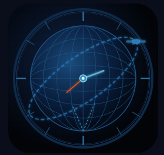

> [!NOTE]
> 本プロジェクトは旧名称 `gps-time-sync` から変更されました。
> This project was formerly known as `gps-time-sync`.

# ChronoGPS

**GPS / NTP 時刻同期ツール — Windows向け**

GPSレシーバーまたはNTPサーバーを使って、WindowsのPC時刻を正確に同期するツールです。  
FT8などのデジタル無線通信で必要な高精度な時刻合わせに特化しています。  
管理者権限がない環境でも「モニタ専用」として安全に動作します。

本ツールは「とりあえず合う」ではなく、  
**なぜその時刻になるのかを説明できること**、  
**OSのルールを正面から守ること**を重視して設計されています。

🌐 [English README](README.en.md)



---

## 設計思想

ChronoGPS は「正確な時刻を、余計な操作なしで得る」ことを目的に設計されています。

- GPS / NTP といった複数の時刻源を状況に応じて使い分けられること
- 時刻同期処理はバックグラウンドで安全に行い、UI は常に安定していること
- アマチュア無線（FT8 など）や計測用途で「信頼できる基準時」を提供すること

派手な演出よりも、**確実に・静かに・長時間動き続ける**ことを重視しています。

---

## Why ChronoGPS?
設計思想（透明性 / 権限の扱い / “モニタ専用モード” の意図）はこちら：
- 🔗 Why ChronoGPS (Discussion): https://github.com/jp1lrt/ChronoGPS/discussions/3

---

## 特徴

- 🌐 **NTP同期（RFC 5905準拠）** — 64bitタイムスタンプ、t1/t2/t3/t4によるoffset/delay計算、msオーダーの高精度補正
- 🛰️ **GPS同期** — オフ / 即時 / 定期の3モード、RMCベースのUTC時刻取得、重複同期防止ロジックあり  
  定期モードはGPS受信直後トリガ方式＋中央値フィルタ（ジッタ抑制）で±0.1秒以内を維持
- ⏱️ **FT8オフセット** — ±0.1秒刻みで時刻を微調整するFT8デジタルモード専用機能
- 📡 **衛星情報表示** — GPS / GLONASS / BeiDou / Galileo / SBAS / QZSS をリアルタイム表示
- 🔒 **非管理者対応** — 起動時に「管理者として再起動」または「モニタ専用で続行」を選択可能
- 🧵 **スレッド安全なGUI** — ワーカースレッド + Queue + メインスレッド更新でTkinterのフリーズを防止
- 🌍 **16言語対応** — 日本語・英語・フランス語・スペイン語・ドイツ語・中国語（簡体・繁体）・韓国語・ポルトガル語・イタリア語・オランダ語・ロシア語・ポーランド語・トルコ語・スウェーデン語・インドネシア語
- 🖥️ **Windowsネイティブ体験** — システムトレイ常駐、×ボタン→トレイ収納、タスクバーアイコン対応

---

## スクリーンショット


---

## 動作モード

### 管理者権限あり
- GPS / NTP によるシステム時刻の自動・手動同期が可能

### 管理者権限なし
起動時に選択できます：
- **管理者として再起動** → UACダイアログで昇格し全機能が使用可能
- **モニタ専用で続行** → GPS受信・衛星表示・NTP時刻確認のみ（時刻書き換えは無効）

---

## 動作環境

- Windows 10 / 11
- Python 3.11以上（スクリプト実行の場合）
- GPSレシーバー（GPS同期使用時）
- 管理者権限（時刻同期を行う場合）

---

## インストール・起動

### exeで使う場合（推奨）

1. `ChronoGPS.exe`、`icon.ico` を同じフォルダに置く
2. `ChronoGPS.exe` を右クリック →「管理者として実行」

### Pythonスクリプトで使う場合

```powershell
python -m venv .venv
.\.venv\Scripts\Activate.ps1
pip install -r requirements.txt
python main.py
```

### exeのビルド方法

```powershell
pyinstaller --onefile --windowed --icon=icon.ico --name=ChronoGPS main.py
```

完了後 `dist\ChronoGPS.exe` が生成されます。

---

## 使い方

### GPS同期

1. GPSレシーバーをPCに接続
2. COMポートとボーレート（通常9600）を選択
3. 「開始」ボタンで受信スタート
4. GPS同期モードを「即時」または「定期」に設定

### GPS同期について（推奨設定）

FT8 / FT4 などのデジタルモード運用では、**GPSの「即時同期」**を行えば通常は十分です。  
GNSS は UTC に直結した絶対時刻基準を提供するため、運用開始前に一度正しく校正すれば、その後も安定した時刻精度が得られます。

定期モードは **毎秒サンプルを蓄積し、設定間隔に到達したタイミングでのみ評価**することで、GNSS受信ジッタを抑えつつ、ドリフト監視を行います。

**定期同期モード**は、以下のような目的で利用してください：
- 長時間稼働時のドリフト監視
- GPS受信状態の変化確認
- 異常検知・検証用途

日常的なFT8/FT4運用では、**即時同期を推奨**します。

### 定期同期（Weak Sync / Interval）の仕様（v2.4.3以降）


> Interval（Weak Sync）は「毎秒サンプル蓄積 → 間隔到達時だけ評価」。
> 閾値内なら補正せず、ジッタ注入を避けつつドリフト監視します。

**定期同期は「常時補正」ではなく、ドリフト監視・検証用途の弱同期です。**  
FT8 / FT4 の実運用では **即時同期（Instant Sync）を推奨**します。


#### どう動くか
- GNSS受信（毎秒）に合わせて、ChronoGPS は **時刻差サンプルを常時蓄積**します（OS時刻は変更しません）
- 設定した同期間隔に到達したタイミングでのみ、蓄積サンプルを評価し、補正の要否を判断します
- 中央値オフセットが閾値内の場合は、GNSS受信ジッタをWindows時刻に注入しないため **補正せず skipped** します

#### 片方向の緩やかなドリフトが見える場合（正常）
ログに `-0.03s → -0.05s` のような緩やかなドリフトが見えることがありますが、  
多くの場合 **PCシステムクロックの自然ドリフト**です。  
閾値内であれば ChronoGPS は意図的に補正しません（監視として正しい挙動です）。

#### デフォルト（弱同期）
- 閾値：**±0.2s**
- サンプル窓：**直近30秒の中央値**

### NTP同期

1. NTPサーバーを入力（デフォルト: `pool.ntp.org`）
   - 日本国内では `ntp.nict.jp` がおすすめ
2. 「NTP同期」ボタンで即時同期、または自動同期を有効化

### FT8オフセット

FT8運用でタイミングがずれる場合、オフセット欄に補正値（秒）を入力して「適用」。  
±0.1秒刻みのクイック調整ボタンも利用可能。

---

## 表示される時刻について

ChronoGPS の画面に表示される「システム時刻」「GPS時刻」「NTP時刻」は、
取得タイミングや更新周期の違いにより、瞬間的に差が見える場合があります。

これは表示上のものであり、バックグラウンドで行われる時刻同期処理自体の精度には影響しません。
実際の同期はミリ秒単位で正しく行われています。

---

## 衛星情報について

| 表示 | 意味 |
|---|---|
| 使用中 (GNSS) | GPS / GLONASS / BeiDou / Galileo の主衛星。時刻解・測位解に直接使用 |
| 使用中 (SBAS) | WAAS / MSAS / EGNOS などの補強衛星。軌道誤差・電離層補正に使用（時刻源ではない） |
| 捕捉中 | 受信できているが時刻解・測位解には使用していない衛星 |

SBAS衛星（日本ではMSAS）は受信しても「使用中」に入らないことがありますが、これは正常な動作です。  
SBASは時刻源ではなく測位補強信号であり、ChronoGPSは業務用GNSS時刻同期機に近い設計を採用しています。

QZSS（みちびき）は日本の準天頂衛星システムです。対応受信機では衛星情報タブに表示されます。  
受信機のファームウェアによっては QZSS の NMEA 出力が無効化されている場合があり、その場合は表示欄が空欄になりますが、これは正常な動作です。

---

## 起動時の注意

- 初回起動時に「このアプリがデバイスに変更を加えることを許可しますか？」と表示されますが、「はい」で進んでください
- **×ボタンはトレイに収納**されます。完全終了はタスクトレイアイコンを右クリック →「終了」
- NTPサーバーはデフォルト `pool.ntp.org` です。`ntp.nict.jp` など好みのサーバーに変更できます


---

## ファイル構成

```
ChronoGPS/
├── main.py               # エントリーポイント
├── gui.py                # メインGUI
├── config.py             # 設定管理（JSON）
├── locales.py            # 多言語対応
├── locales_override.py   # ローカライズ上書き
├── nmea_parser.py        # NMEAパーサー
├── ntp_client.py         # NTPクライアント
├── time_sync.py          # 時刻同期
├── autostart.py          # 自動スタート管理
├── tray_icon.py          # システムトレイ
├── requirements.txt      # 依存パッケージ
├── icon.png              # アプリアイコン（PNG）
├── icon.ico              # アプリアイコン（ICO）
└── gps_time_sync_config.json  # 設定ファイル（自動生成）
```

---

## ダウンロード

公式の配布は GitHub Releases を通じて行います。常に最新版は Releases の「Latest」を参照してください。

- 最新リリース（常に最新のビルド）: https://github.com/jp1lrt/ChronoGPS/releases/latest
- [ChronoGPS.exe](https://github.com/jp1lrt/ChronoGPS/releases/latest/download/ChronoGPS.exe) — Windows実行ファイル
- [icon.ico](https://github.com/jp1lrt/ChronoGPS/releases/latest/download/icon.ico) — アプリアイコン

配布物（例）
- ChronoGPS.exe — Windows 実行ファイル（PyInstaller ビルド）
- icon.ico — アプリケーションアイコン
- checksums.txt — 各ファイルの SHA256 チェックサム

ダウンロードしたバイナリの検証（PowerShell）
```powershell
# SHA256 ハッシュを表示
Get-FileHash .\ChronoGPS.exe -Algorithm SHA256
```
出力されたハッシュを releases に添付された `checksums.txt` の該当行と照合してください。

セキュリティ上の注意
- 公式ダウンロードは必ず GitHub Releases（上のリンク）から行ってください。非公式サイトやサードパーティの配布は避けてください。  
- 配布物には GPG 署名（`checksums.txt.asc`）を添付しています。なお、Windows Authenticode 署名（SmartScreen 警告の抑制）は現在未対応です。  
- ウイルススキャンの結果（VirusTotal 等）を公開することも検討してください。

---

## ウイルス対策ソフトによる誤検知について

一部のウイルス対策ソフトが ChronoGPS.exe を誤検知する場合があります。
これは PyInstaller でビルドされた exe に対してヒューリスティック検出が反応するもので、
悪意のあるコードは含まれていません。

ソースコードはすべて公開されており、ご自身でビルドすることも可能です。

- VirusTotal スキャン結果: https://www.virustotal.com/gui/file-analysis/NjQwMzVkOTE2ZGFjZTZkZDVjNzFlMmJkYjZkYzBjY2U6MTc3MTQ4MDcyMw==/detection
- 誤検知であることを Microsoft に報告済みです。

---

### 日本語 — ダウンロード後の検証手順

1. GitHub から公開鍵を取得してインポート:
   ```bash
   # Linux / macOS
   curl -s https://github.com/jp1lrt.gpg | gpg --import

   # Windows (PowerShell)
   Invoke-WebRequest -Uri https://github.com/jp1lrt.gpg -OutFile mypubkey.asc
   gpg --import mypubkey.asc
   ```

2. `checksums.txt` の署名を検証:
   ```bash
   gpg --verify checksums.txt.asc checksums.txt
   ```
   出力に「正しい署名（Good signature）」が表示され、次を確認してください:
   - 鍵ID: `864FA6445EE4D4E3`
   - UID: `Yoshiharu Tsukuura <jp1lrt@jarl.com>`

3. 配布ファイルの SHA256 を計算して `checksums.txt` と照合:
   ```powershell
   # Windows PowerShell
   Get-FileHash ChronoGPS.exe -Algorithm SHA256

   # Linux / macOS
   sha256sum ChronoGPS.exe
   ```
   計算結果のハッシュが `checksums.txt` の該当行と完全に一致することを確認してください。

4. 注意:
   - 署名が別の鍵を示す、または「不正な署名」の場合は配布物を信頼せず、リポジトリの管理者に連絡してください

---

## ライセンス

MIT License — © 2026 津久浦 慶治 (JP1LRT)

詳細は [LICENSE](LICENSE) を参照してください。

---

## 作者

**津久浦 慶治 / Yoshiharu Tsukuura**  
アマチュア無線局 **JP1LRT** / [@jp1lrt](https://github.com/jp1lrt/ChronoGPS)

---

## 寄付（Donate）

もしこのツールが役に立ったと感じていただけたら、  
コーヒー代くらいの感覚で応援していただけると今後の開発の励みになります 🪙

[](https://www.paypal.me/jp1lrt)
[](https://www.paypal.me/jp1lrt)

---

